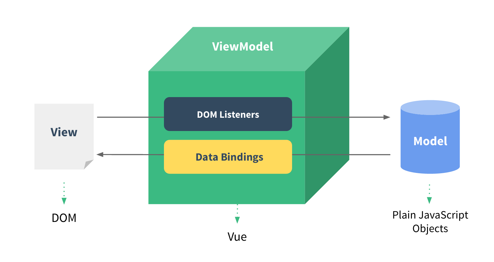

# Notes in Learning VUE

WEI Xiao-Miao 516015910018

## 1. Intro of Vue

### 1.1 What is Vue

> Vue (pronounced /vjuː/, like **view**) is a **progressive framework** for building user interfaces. Unlike other monolithic frameworks, Vue is designed from the ground up to be incrementally adoptable. The core library is focused on the view layer only, and is easy to pick up and integrate with other libraries or existing projects. On the other hand, Vue is also perfectly capable of powering sophisticated Single-Page Applications when used in combination with modern tooling and supporting.
>
> ​                                                                *from*   *vuejs.org*

To briefly conclude the intro above Vue.js is

- **A framework (or lib) of javascript to build an interactive web page;**
- **A group of web page widgets bound with datas and useful APIs.**

### 1.2 Features of Vue

- Concise: it simplifies the front-end project into HTML template + datas + Vue instance.
- Data drive: it can trace expression in template and calculates by the shared data.
- Modularity: coupling and decoupling modules to build the page.
- Lightweight: it weights only 24kb and has no dependency on other frameworks.
- Swift: precisely realize the update of DOM through asynchronism.
- Progressive: it can be partly or totally uesed in the whole script of a website.

### 1.3 Conception of Vue

The core concepton of Vue is its **reusable components**.

In the perspective of Vue, the front-end page could be seen as an **assembly of a group of vue instances**, and each one contains its own HTML, CSS and Javascript. All those vue components render the anywhere in the piece of webpage.


Vue components also handle with datas and reactions. which is called **data bound**. To realize this, vue components store datas as members and react with input and display datas in the page by the same lable in HTML(''id'') and script(''el'').

## 2. Coding in Vue

### 2.1 Installation

1. Direct <script> Include

   Simply vue.js and include with a script tag when develop front-end page or small scale application. Vue will be registered as a global variable. Or link to CDN in HTML like:

   ```html
   <script src="https://cdn.jsdelivr.net/npm/vue@2.5.17/dist/vue.js">
   </script>
   ```

    

2. NPM install

   When building large scale applications with Vue, npm installation pairs nicely with module bundlers such as Webpack or Browserify. Vue also provides accompanying tools for authoring Single File Components.

   ```shell
   $ npm install vue
   ```

### 2.2 An vue instance

The core conception( as mentioned in 1.3 ) is to use vue instance to render data in to components on the webpage. 

In HTML file, component bounds with vue instance by id and show datas in {{}}. Like:

```html
<div id="app">
  {{ message }}
</div>
```

Coherently, in script, an vue instance is created through vue constructor. Like:

```javascript
var app = new Vue({
  el: '#app',
  data: {
    message: 'Hello Vue!'
  }
})
```

What is show on the webpage is as follow:

> Hello Vue!

This is a simple vue instance and shown its counterpart components on HTML. Diffirent from a simple string in HTML. this data  ```app.message``` has been bound with DOM ```<div id = ''app''>```. Every components in Vue is **reactive** and can be modified **dynamically**.

Morever, except for 'id', the way of bind can also call up data like:

```HTML
<span v-bind:title="message">
```

```v-bind``` instruction ask for the component<span> react according to the data message.

### 2.3 Logic control

1. Conditionals statement assembling in HTML label reacts and changes the page according to the data in its counterpart vue instance. For example, 

   the HTML file:

   ```html
   <div id="condition"> 
      <span v-if="seen">seen is ture</span>
   </div>
   ```

   the Javascript file:

   ```javascript
   var condition = new Vue({
     el: '#condition',
     data: { 
     	seen: true  
     }
   })
   ```

   shown in webpage:

   > seen is ture

   In the console. enter ```condition.seen = false``` , then the text will dissmiss.

2.  Loops execute just like conditionals, for example, the ```v-for``` instruction shown in HTML:

   ```html
   <div id="toDoList">
     <ol>
       <li v-for="todo in events">
         {{ todo.text }}
       </li>
     </ol>
   </div>
   ```

   Javascript file:

   ```javascript
   var toDoList = new Vue({
     el: '#toDoList',
     data: {
       events: [
         { text: 'Learn JavaScript' },
         { text: 'Learn Vue' },
         { text: 'Build something awesome' }
       ]
     }
   })
   ```

   shown in webpage:

   > Learn JavaScript
   >
   > Learn Vue
   >
   >
   > Build something awesome

   It can also react when sent console at ```toDoList.events.push({text: 'Newly added'})``` , the text "Newly added" will show up in the page.

### 2.4 React dynamically 

To realize reactivity, Vue provides the ```v-on``` instruction to catch and bind with events. It's like:

```HTML
<div id="change">
  <p>{{ message }}</p>
  <button v-on:click="changeMessage">Change Above</button>
</div>
```

```javascript
var change = new Vue({
  el: '#change',
  data: {
    message: 'Hello Vue!'
  },
  methods: {
    changeMessage: function () {
      this.message = 'Message changed!'
    }
  }
})
```

When clicked, the button calls up the method ```changeMessage``` in the vue instance ```change``` and change its data ```message``` into 'Message changed!'.

It's a feature of Vue that when changing the data in the instance, the code has nothing to do with DOM widgets. That's beacuse all those operations are executed by Vue itself. The only thing our code concerns is the logic when the page runs.

### 2.5 Two-way binding

The instruction ```v-model``` is able to create a **two-way binding** on <input>, <select> and <textarea> and anyother reactive HTML elements. 



```v-model``` can adapt a right way to update elements according to the types and datas. Essentially, those models finish the work of updating datas on user input events (from letf to right) and in turn, it output expected datas to DOMs and make them shown (from right to left).

Models in vue including

- Text:  ```<input v-model='massage'>```
- Checkbox:  ```<input type="checkbox" v-model="checked">```
- Select:  ```<select v-model="selected">```

and etc. 

## 3. Tools in Vue

### 3.1 Vue CLI 3

If the situation occurs that a largescale Vue project shall be created, it would be a bit complicated to organize the whole project and write files one by one. **Vue CLI 3** uses TypeSctipt to create a new project framework of Vue, making large-scale development clean and standardized.

The way of creating:

```shell
$ npm install --global @vue/cli
$ vue create my-project-name
```

The first instruction installed  Vue CLI through rpm and the second one created a veu project in present directory.

### 3.2 Sentry

**Sentry** is an error tracking that helps developers monitor and fix crashes in real time. To use it, we should grab the Sentry JavaScript SDK:

```HTML
<script src="https://cdn.ravenjs.com/<VERSION>/vue/raven.min.js">
</script>
```

Sentry automatically captures errors thrown by Vue’s `errorHandler`.  It Improves workflow with a full view of releases and detect in which version a bug first appeared, merge duplicates, and know if things regress in a future release.

### 3.3 Testing tools

As it's mentioned in the ppt, *intro to javascript*, **Karma** and **Jasmine** are test runners based on node.js. Surely it can support the test project of Vue. **Assertion libs** are also various. 

Test work on vue shall **import Vue.js** to introduce methods in Vue components and a proper assertion lib. And then, some common  assertion statements can be added to the test. An example of javascript file ``` ./myVue.js ``` and its test project ```/myVue.test.js```.

```javascript
//  myVue.js
export default {
    data () {
      return {
        message: 'hello!'
      }
    },
    created () {
      this.message = 'bye!'
    }
}
```

```javascript
// myVue.test.js
import Vue from 'vue'
import MyComponent from 'myVue.js'
describe('MyComponent', () => {
    
  it('correctly sets the message when created', () => {
    const vm = new Vue(MyComponent).$mount()
    expect(vm.message).toBe('bye!')
  })
    
  it('sets the correct default data', () => {
    const defaultData = MyComponent.data()
    expect(defaultData.message).toBe('hello!')
  })
})
```

## 4. Comparison to raw JS

### Pros: 

- Abstrsction:

  Vue perfectly encapsulates method and data in Raw js and provides a more easy and direct way to manipulate the page. The conception of Vue model matches well with DOM in HTML, making it logically smooth for users when developing front-end.

- Data bind:

  Vue listens input and events from DOM and bind datas with its models in script, and in turn, updating the page accoding to these changes. This kind of Two-way bind makes the reaction of webpages a convenient and elegant way. 

- Progressive:

  Vue organizes its components in groups. When some components are common for diffrent pages, Vue groups them up and share the them in pages to avoid re-render. Moreover, progressive also means that vue can be a part of present project in server to add more reactive events.

### Cons:

- Maintain cost:

  The flexibility of Vue allows more than one way to realize the same demand. It easily causes the problems in maintain a project for diffrent code styles. Especially in multiple logic branches, vue can make the code clean but varies so much in code style.

- Debugging:

  Vue's inner realization is somehow like a black box that helps user do things elegantly and easily. But when bug ocurrs on rending template (no logical errors, Sentry and testing can avoid this kind of bugs), it would be extremely complicated and annoying to find bugs. For all the rending work is taken over by Vue's inner realization.
