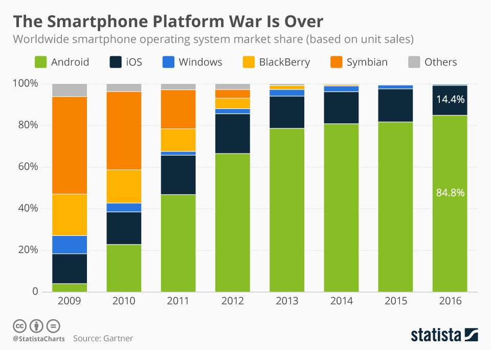

# Learning Report

WEI Xiao-Miao 516015910018

## 1. Native App

A native application is a software program that is developed for use on a particular **platform** and **device**.

- Device: The hardware on which appliations running, provides some basic device-specific functions as  net connection, playing sound, GPS info and etc. 
- Platform: The OS driving the hardware and provides APIs to apps to manipulate hardwares for achieving its own function. 

### 1.1 The Building of Native App

native apps are applications **written in basic programming languages** that the platform they are being built for accepts. For example, Swift or Objective-C is used to write native iOS apps, Java is used to write native Android apps, and C# for the most part for Windows Phone apps. 

As the graph shown above, up to 2016, the whole market can be generally divided as Apple's iOS camp and Google's Android camp.

Apple and Google offer app developers their own development tools, interface elements and standardised SDK(Software Developing Kit); Xcode and Android Studio. This allows any professional developer to develop a native app relatively easily.

### 1.2 The Advantages of Native App

- **Swift response:**
  Native apps offer the fastest, most reliable and most responsive experience to users for their height authority in calling APIs provided by system.
- **Wider device functionality:**
  The access to device hardware, as the camera, microphone, compass and accelerometer, for native apps, can be very friendly and easy. Giving native apps a wider device functionality.
- **Push notifications:**
  Native apps can make use of push notifications, alerting users when their attention is required in the app.

### 1.3 The Disadvantages of Native App

- **Platfom limitation:**
  An native app runs only on the platform that it was build for. Different os require totally diffrent codebase and developing method for native apps. Even native apps for the same platfom shall be modified when transmitted in diffrent device.(iPhone app and iPad app).

  

- **Large cost of develoment:**
  Development for native apps tends to be more complicated, apps for different OS could be different projects. Moreover, the span of the review that App Store takes will also last long. Making the update hysteretic.

## 2 Web Apps

A web app “*is an application that is accessed via a web browser over a network such as the Internet” (Wikipedia*). they are really **websites** that, in many ways, look and feel like native applications, but are not implemented as such. They are run by a browser and typically written in HTML.

### 2.1 Building Web Apps

The vast majority of Web Apps are built in **JavaScript, CSS, and HTML5.** Unlike an iOS or Android app, there is no software development kit (SDK) for a developer to work with.

There are templates and frameworks like Angular, React, and Vue.js that can be used to get a quick start.

### 2.2 The Advantages of Web App

- **Multiple platforms:**
  Web apps runs on a browser and get data from server, it doesn't require a certain OS. A single development can be adapted by all platforms.
- **Maintainability:**
  The kenal code of web apps is stored on server instead of users device. So web apps can be updated or fixed immediately without user's operation.

### 2.3 The Disadvantages of Web App

- **Data security:**
  All user's data shall be stored in the server. The borken of serve can easily cause a leak of private data.

- **Device limitation:**
  Web apps has no much authority to use some widget of devide, such as camera and microphone.

